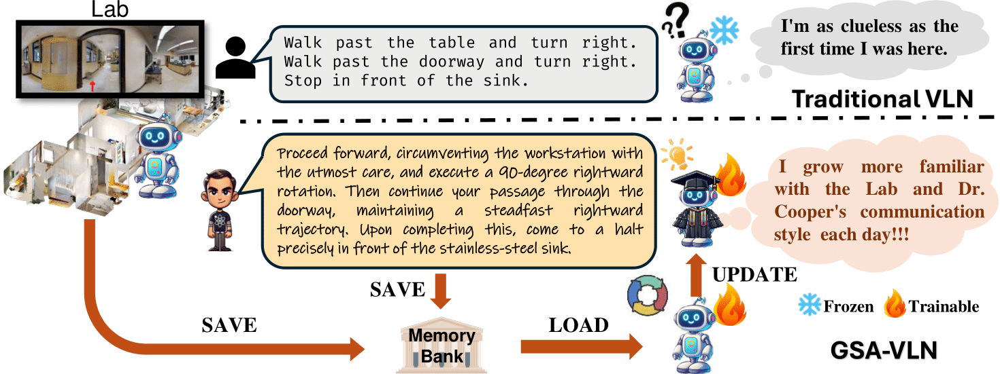

# GSA-VLN
**This repository is the official implementation of the ICLR 2025 paper "General Scene Adaptation for Vision-and-Language Navigation".**

Vision-and-Language Navigation (VLN) tasks mainly evaluate agents based on one-time execution of individual instructions across multiple environments, aiming to develop agents capable of functioning in any environment in a zero-shot manner. However, real-world navigation robots often operate in persistent environments with relatively consistent physical layouts, visual observations, and language styles from instructors. Such a gap in the task setting presents an opportunity to improve VLN agents by incorporating continuous adaptation to specific environments. To better reflect these real-world conditions, we introduce GSA-VLN (General Scene Adaptation for VLN), a novel task requiring agents to execute navigation instructions within a specific scene and simultaneously adapt to it for improved performance over time.  To evaluate the proposed task, one has to address two challenges in existing VLN datasets: the lack of out-of-distribution (OOD) data, and the limited number and style diversity of instructions for each scene. Therefore, we propose a new dataset, GSA-R2R, which significantly expands the diversity and quantity of environments and instructions for the Room-to-Room (R2R) dataset to evaluate agent adaptability in both ID and OOD contexts. Furthermore, we design a three-stage instruction orchestration pipeline that leverages large language models (LLMs) to refine speaker-generated instructions and apply role-playing techniques to rephrase instructions into different speaking styles. This is motivated by the observation that each individual user often has consistent signatures or preferences in their instructions,  taking the use case of home robotic assistants as an example. We conducted extensive experiments on GSA-R2R to thoroughly evaluate our dataset and benchmark various methods, revealing key factors enabling agents to adapt to specific environments.  Based on our findings, we propose a novel method, Graph-Retained DUET (GR-DUET), which incorporates memory-based navigation graphs with an environment-specific training strategy, achieving state-of-the-art results on all GSA-R2R splits. 




## Implementation Steps

### Step 1
Follow [DUET](https://github.com/cshizhe/VLN-DUET/tree/main) to install the Matterport3D Simulator and download the required data

### Step 2
Download the preprocessed features and connectivity graphs from [ScaleVLN](https://github.com/wz0919/ScaleVLN)

### Step 3
Download the instructions of GSA-R2R dataset from [here](https://drive.google.com/file/d/12PoK6zO5HflCLen6SBSLQUpU9gEhZ602/view?usp=sharing)

[optional] Download the [pretrained](https://drive.google.com/file/d/1ZxS4h725lt2U2-Oe7Xn_5y3k9nq9nYRH/view?usp=sharing) and [fine-tuned](https://drive.google.com/file/d/1-1tHc3-lfgn8BZuhJj2h6R45YIAog159/view?usp=sharing) checkpoints for GSA-R2R.

### Step 4
Run the pretraining code with the ground-truth navigation graph

```
cd GR-DUET
cd pretrain_src
bash run_r2r.sh
```

**Note**: The pretraining requires a `pano_inputs.h5` file which we save all the inputs to speed up the training. You can either run the `get_pano_inputs.py` to generate it or download it from [here](https://drive.google.com/file/d/1Za6E7-Pl3P-uPAVThmdoQQpbszqVQ_A1/view?usp=sharing).

### Step 5

Finetune and evaluate the model

```
cd map_nav_src
bash scripts/run_gsa_r2r.sh
```

## Citation

If you find this work helpful, please consider citing:

```bibtex
@inproceedings{hong2025general,
	title={General Scene Adaptation for Vision-and-Language Navigation},
	author={Haodong Hong and Yanyuan Qiao and Sen Wang and Jiajun Liu and Qi Wu},
	booktitle={The Thirteenth International Conference on Learning Representations},
	year={2025}
}
```

